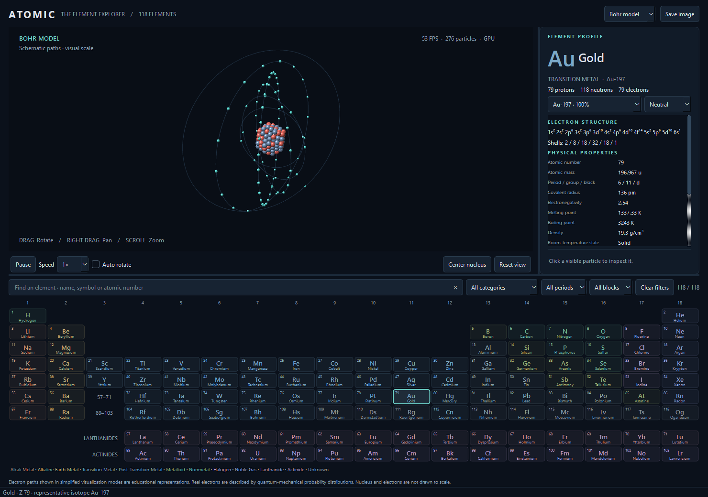
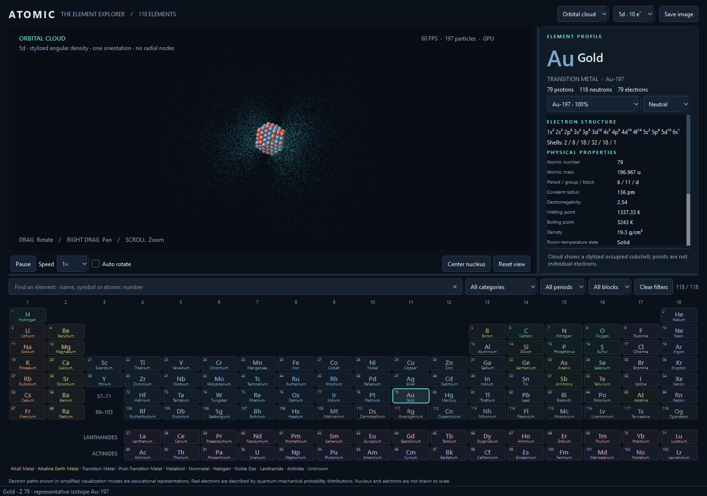

# ATOMIC — Periodic atom explorer

Автономное настольное приложение на Python для изучения всех 118 элементов. Интерактивная таблица, трёхмерная модель атома, электронные конфигурации, изотопы и ионы. Интерфейс — на английском языке; подключение к интернету при работе не требуется.

## Быстрый запуск

На этом компьютере окружение уже подготовлено. Откройте `start.cmd` или выполните из папки проекта:

```powershell
.\.venv\Scripts\python.exe main.py
```

Обычный запуск в активированном окружении:

```text
python main.py
```

## Установка на другом компьютере

Нужны Python 3.11+ (64 bit), настольная ОС и видеодрайвер с OpenGL 3.3 для GPU-режима. Проверено на Windows с Python 3.12.14. Linux/macOS поддерживаются используемыми библиотеками, но здесь не проверялись.

```powershell
py -3 -m venv .venv
.\.venv\Scripts\Activate.ps1
python -m pip install -r requirements.txt
python main.py
```

В `cmd.exe` активация: `.venv\Scripts\activate.bat`. Если PowerShell запрещает активацию, менять политику не нужно:

```powershell
.\.venv\Scripts\python.exe -m pip install -r requirements.txt
.\.venv\Scripts\python.exe main.py
```

Linux/macOS:

```sh
python3 -m venv .venv
source .venv/bin/activate
python -m pip install -r requirements.txt
python main.py
```

Интернет нужен только для первоначальной установки библиотек. Все научные данные, геометрия и шейдеры находятся в проекте. В приложении нет онлайн-API, удалённых баз, веб-интерфейса или телеметрии.

## Возможности

- 118 элементов с цветами категорий, подсказками, подсветкой выбора и управлением с клавиатуры.
- Поиск по английскому имени, символу и атомному номеру; совместные фильтры категории, периода и блока.
- Компактное детерминированное ядро с отдельными протонами и нейтронами; точное число отображаемых частиц для выбранного изотопа.
- Хранимые нейтральные конфигурации, строгий парсер и вычисление оболочек из занятости подоболочек, включая Cr, Cu, Nb, Mo, Ru, Rh, Pd, Ag, Pt, Au и Lr.
- Природные изотопы с долями распространённости, представительный изотоп для каждого элемента, а также H-3, C-14, U-234/235/238 и несколько изотопов Pu.
- Заряды −3…+3 с защитой от отрицательного числа электронов, обозначением иона и явной пометкой приближения.
- Три режима, анимация, пауза, скорости 0.25×…4×, плавная камера, выбор частиц лучом, экспорт PNG.
- Автоматический программный рендерер при сбое OpenGL, видимый счётчик FPS и размеров сцены.

## Управление

| Действие | Управление |
| --- | --- |
| Выбор элемента | Щелчок по плитке; стрелки ←/→ при фокусе таблицы |
| Поиск | Поле поиска / `Ctrl+F`; точное совпадение выбирается сразу |
| Вращение | Перетаскивание левой кнопкой |
| Панорамирование | Правая или средняя кнопка + перетаскивание |
| Масштаб | Колесо мыши |
| Выбор частицы | Короткий щелчок по видимой сфере |
| Сброс камеры | `Reset view` / `R` |
| Центрирование | `Center nucleus` |
| Пауза | `Pause` / `Resume` / `Space` |
| Скорость / вращение сцены | `Speed` / `Auto rotate` |
| Изотоп и заряд | Два списка под названием элемента |
| Режим | Верхний список; в облачном режиме рядом появляется список подоболочек |
| Снимок модели | `Save image` — PNG с информационной надписью |
| Выход | `Ctrl+Q` |

При выборе другого элемента восстанавливается нейтральный атом и его представительный изотоп; пауза и скорость сохраняются. Разделители панелей перетаскиваются. На небольшом окне таблица и свойства прокручиваются; наведите курсор на сокращённое имя, чтобы прочитать его полностью.

## Режимы визуализации

**Bohr model** — наклонённые кольцевые направляющие, показывающие главные оболочки. Частицы движутся по условным траекториям.

**Shell model** — сферические оболочки, показанные прозрачными меридианами и параллелями. Электроны сохраняют схематические пути.

**Orbital cloud** — 10 000 заранее рассчитанных точек для одной занятой подоболочки, выбранной в верхнем списке. Поддерживаются угловые формы s, p_z, d_xz и f_xyz. Отдельные электроны и траектории в этом режиме не рисуются; ядро остаётся доступно для выбора.

## Научные ограничения

Это образовательная визуализация, не квантово-механический расчёт. Электроны не летают по изображённым траекториям. Масштабы ядра, электронов и оболочек намеренно различны; визуальный радиус не равен табличному радиусу атома.

Облака используют квадрат приближённого углового множителя и искусственное радиальное распределение. Радиальные узлы, экранирование, корреляции, спин, все магнитные ориентации и решение уравнения Шрёдингера не реализованы. Одно показанное облако не является суммой всех занятых орбиталей атома.

Ионы — упрощение: электроны удаляются сначала с наибольшего `n`, затем `l`, добавляются по порядку Маделунга. Перестройка конфигурации и устойчивость ионов не рассчитываются; не каждый доступный заряд соответствует связанному состоянию. Для отрицательных ионов сверхтяжёлых элементов возможно появление условной восьмой оболочки.

Для нейтральных атомов используются сохранённые конфигурации, а не универсальное правило заполнения. Некоторые тяжёлые конфигурации предсказаны теоретически. Lr приведён к конфигурации NIST `[Rn] 5f14 7s2 7p1`.

«Atomic mass» — табличная атомная масса; для ряда радиоактивных элементов исходный справочник вместо стандартного атомного веса даёт массовое число представительного изотопа. Это поле не меняется при выборе изотопа. Число нейтронов определяется выбранным **целым массовым числом**, а не округлением средней массы природной смеси. По умолчанию выбирается наиболее распространённый природный изотоп; при отсутствии природных долей — справочный представитель. Полной базы изотопов, периодов полураспада и стабильности нет.

Радиус — **ковалентный**, в pm. Плотности нормализованы в g/cm³, температуры — K. Значения зависят от условий и аллотропной формы; плавление гелия требует давления, для некоторых веществ существенна сублимация. Неизвестные значения отображаются как `—`; неизмеренные термодинамические свойства и состояние элементов Z≥104 не выдаются за наблюдения. Даты открытия заполнены лишь для части элементов; спорные и отсутствующие даты не выдумываются.

Источники, преобразования и лицензии: [data/ATTRIBUTION.md](data/ATTRIBUTION.md).

## Архитектура и производительность

PySide6 создаёт нативное окно; PyOpenGL и NumPy отвечают за GPU-рендеринг и массивы координат. Вместо отдельных сферических сеток для каждой частицы используются **sphere impostors**: один пакет точек, фрагментный шейдер восстанавливает освещение и глубину сферической поверхности. Для сотен мелких частиц это проще и дешевле инстансинга полигональных сфер, без GLUT и дополнительных движков.

В нормальном режиме сцена требует двух вызовов отрисовки: частицы и направляющие/облако. Ядро, направляющие и облака кэшируются; GPU-буферы создаются один раз. Каждый кадр обновляется только компактный массив электронов. Положение ядра генерируется один раз из сферического фрагмента плотной FCC-упаковки, с детерминированным поворотом, небольшим шумом и перемешиванием типов нуклонов. Межчастичного силового расчёта нет.

Анимация и сглаживание камеры используют elapsed time. Таймер имеет номинальную цель 60 FPS (16 ms); счётчик измеряет частоту рисования кадров, а не частоту обновления монитора. После сворачивания время ограничивается, чтобы избежать скачка. Пауза останавливает и электронное движение, и автоматическое вращение; ручная камера остаётся доступной.

В локальном контрольном прогоне U, Pu и Og работали примерно на 60 FPS. Точные результаты и время переключения всех элементов находятся в [docs/qa-gpu.json](docs/qa-gpu.json) и [docs/qa-software.json](docs/qa-software.json). Скорость зависит от драйвера, дисплея и компьютера; начальная загрузка временно снижает средний показатель.

Если OpenGL недоступен, приложение сообщает об этом в строке состояния и переключается на CPU-проекцию с QPainter. Принудительный запуск:

```text
python main.py --software
```

Программный режим сохраняет управление и данные, но сортирует частицы по глубине и не обеспечивает точную попиксельную окклюзию прозрачных оболочек. Для облака рисуется каждое третье значение исходного массива. Это режим совместимости, а не новый физический алгоритм.

## Структура проекта

```text
main.py                     запуск и обработка ошибок загрузки
app/                        главное окно, тема, настройки
models/                     Element, Isotope, Atom, парсер конфигураций
data/                       118 записей, валидация, каталог, источники и лицензии
ui/                         таблица, поиск, свойства, кнопки управления
rendering/                  сцена, камера, геометрия, шейдеры, GPU/CPU-виджеты
utils/performance.py        измерение частоты кадров
tests/                      данные, конфигурации, атомы, геометрия, Qt-взаимодействия
tools/build_data.py         воспроизводимое преобразование исходного справочника
tools/validate_app.py       реальный запуск и сценарий приёмочной проверки
docs/                       снимки и машинно-читаемые отчёты
archive/                    прежний прототип, сохранён без изменений
```

Научные модели не зависят от Qt или OpenGL. Рендерер получает готовый `Atom`, а не читает JSON. Ключевые настройки находятся в `app/settings.py`, цвета — в `app/theme.py`.

## Тестирование

```powershell
.\.venv\Scripts\python.exe -m pip install -r requirements-dev.txt
.\.venv\Scripts\python.exe -m pytest -q
.\.venv\Scripts\python.exe tools\validate_app.py
.\.venv\Scripts\python.exe tools\validate_app.py --software
```

Qt-тесты и приёмочный сценарий открывают временные окна. Для тестов без дисплея можно установить `QT_QPA_PLATFORM=offscreen`; приёмочный GPU-сценарий требует графическую сессию. `pytest.ini` исключает архив из автоматического обнаружения тестов.

Проверяются все 118 записей, повреждённый JSON, дубликаты, единицы плотности, исключения конфигураций, изотопы, допустимые и невозможные заряды, воспроизводимость ядра, независимость движения от FPS, кнопки, поиск, фильтры, выбор частиц и экспорт. Сценарий приёмки дополнительно проверяет реальный GPU, все режимы, мышь, изменение размеров окна, быстрое переключение, FPS тяжёлых элементов и резервный рендерер.

## Как изменить данные

`data/elements.json` — рабочий локальный справочник. Исправляйте значения с указанием источника в `data/ATTRIBUTION.md`. Неизвестное значение записывайте как `null`. Число изотопа — целое, конфигурация — строка вида `1s2 2s2 2p6` или `[Ne] 3s1`; список оболочек должен совпадать с результатом парсера. Приложение проверяет все 118 записей до открытия главного окна и показывает понятное сообщение при повреждении.

Для повторной сборки из сохранённого `data/source_periodic_table.json`:

```text
python tools/build_data.py
python -m pytest -q
```

Эта команда **перезаписывает** рабочий справочник. Сначала внесите нужное преобразование в `tools/build_data.py`. `periodictable` используется только при такой сборке, для обычного запуска он не нужен. Результат содержит ровно 118 признанных элементов; гипотетический 119-й из исходного файла исключается.

## Скриншоты

Снимки реального запуска, автоматически обновляемые приёмочной проверкой:





Дополнительные снимки: `docs/gpu-shell.png`, `docs/gpu-compact.png`; аналоги CPU имеют префикс `software-`.
